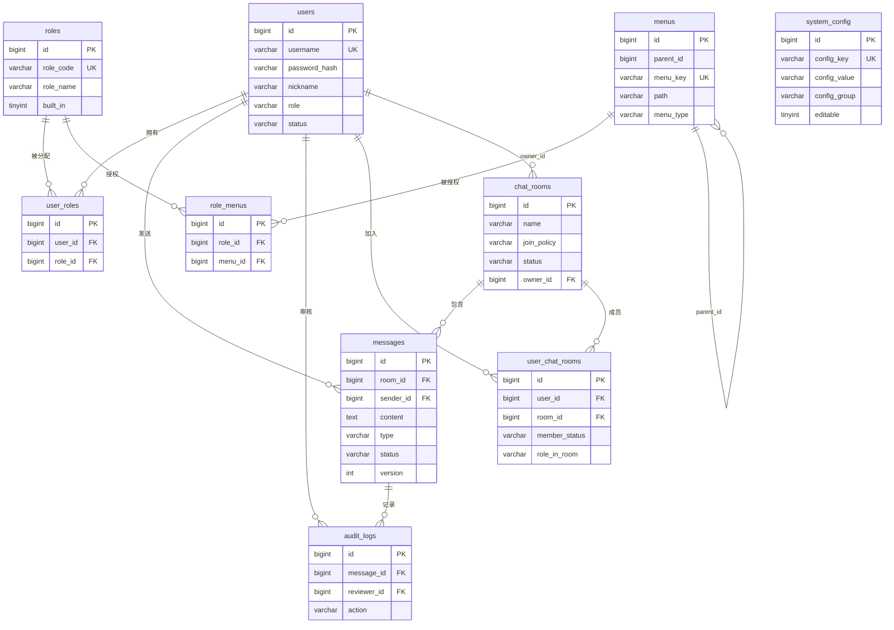

# 数据库设计

> 表结构以 Flyway 迁移脚本为准：`backend/src/main/resources/db/migration/{mysql|postgresql}/`。  
> 实体基类 `BaseDO` 为所有业务表提供 `created_at`、`updated_at`、`deleted`（逻辑删除）。

---

## 一、ER 关系图

---

## 二、表结构说明

### 2.1 用户与认证

#### `users` 用户表

| 字段 | 类型 | 约束 | 说明 |
|------|------|------|------|
| id | BIGINT | PK, AUTO_INCREMENT | 用户 ID |
| username | VARCHAR(50) | UNIQUE, NOT NULL | 登录名 |
| password_hash | VARCHAR(100) | NOT NULL | BCrypt 密码哈希 |
| nickname | VARCHAR(50) | | 昵称 |
| role | VARCHAR(20) | NOT NULL, DEFAULT 'USER' | 主角色：`USER` / `ROOM_ADMIN` / `SYS_ADMIN`（与 RBAC 并存，用于快捷判断） |
| status | VARCHAR(20) | NOT NULL, DEFAULT 'ACTIVE' | `ACTIVE` / `BANNED` |
| created_at | DATETIME(6) | NOT NULL | 创建时间 |
| updated_at | DATETIME(6) | NOT NULL | 更新时间 |
| deleted | TINYINT(1) | NOT NULL, DEFAULT 0 | 逻辑删除 |

> 默认管理员 `admin` 由应用启动时 `AdminInitializer` 写入，非 SQL 脚本硬编码。

---

### 2.2 聊天室与成员

#### `chat_rooms` 聊天室表

| 字段 | 类型 | 约束 | 说明 |
|------|------|------|------|
| id | BIGINT | PK | 聊天室 ID |
| name | VARCHAR(100) | NOT NULL | 名称 |
| description | VARCHAR(500) | | 描述 |
| max_users | INT | NOT NULL, DEFAULT 500 | 最大成员数 |
| join_policy | VARCHAR(20) | NOT NULL, DEFAULT 'OPEN' | `OPEN` 开放加入 / `APPROVAL` 需审批 |
| status | VARCHAR(20) | NOT NULL, DEFAULT 'ACTIVE' | `ACTIVE` / `PAUSED` / `CLOSED` |
| owner_id | BIGINT | FK → users.id | 创建者/房主 |
| created_at / updated_at / deleted | | | 公共字段 |

**索引**：`idx_rooms_status(status)`

#### `user_chat_rooms` 用户-聊天室关联表

| 字段 | 类型 | 约束 | 说明 |
|------|------|------|------|
| id | BIGINT | PK | |
| user_id | BIGINT | NOT NULL, FK | 用户 ID |
| room_id | BIGINT | NOT NULL, FK | 聊天室 ID |
| member_status | VARCHAR(20) | NOT NULL, DEFAULT 'JOINED' | `PENDING` / `JOINED` / `LEFT` / `REJECTED` |
| role_in_room | VARCHAR(20) | NOT NULL, DEFAULT 'MEMBER' | `MEMBER` / `ADMIN` |
| joined_at | DATETIME(6) | | 加入时间 |
| created_at / updated_at / deleted | | | 公共字段 |

**唯一约束**：`uk_user_room(user_id, room_id)`

---

### 2.3 消息与审核

#### `messages` 消息表

| 字段 | 类型 | 约束 | 说明 |
|------|------|------|------|
| id | BIGINT | PK | 消息 ID |
| room_id | BIGINT | NOT NULL, FK | 所属聊天室 |
| sender_id | BIGINT | NOT NULL, FK | 发送者 |
| content | TEXT | NOT NULL | 消息正文 |
| type | VARCHAR(20) | NOT NULL, DEFAULT 'CHAT' | `CHAT` 普通聊天 / `NOTIFICATION` 系统通知 |
| status | VARCHAR(20) | NOT NULL, DEFAULT 'PENDING_REVIEW' | `PENDING_REVIEW` / `APPROVED` / `REJECTED` / `TIMEOUT` |
| submitted_at | DATETIME(6) | NOT NULL | 提交时间（推送排序依据） |
| reviewed_at | DATETIME(6) | | 审核完成时间 |
| reviewer_id | BIGINT | FK | 审核人（超时可为 NULL） |
| version | INT | NOT NULL, DEFAULT 0 | 乐观锁版本号 |
| created_at / updated_at / deleted | | | 公共字段 |

**索引**：

- `idx_messages_room_status_time(room_id, status, submitted_at)` — 房间历史查询
- `idx_messages_sender(sender_id)` — 我的消息
- `idx_messages_status_time(status, submitted_at)` — 待审核/超时扫描

#### `audit_logs` 审核日志表

| 字段 | 类型 | 约束 | 说明 |
|------|------|------|------|
| id | BIGINT | PK | |
| message_id | BIGINT | NOT NULL, FK | 关联消息 |
| reviewer_id | BIGINT | FK | 审核人；系统自动处理（超时）时为 NULL |
| action | VARCHAR(20) | NOT NULL | `APPROVE` / `REJECT` / `TIMEOUT` |
| reason | VARCHAR(500) | | 拒绝原因 |
| created_at / updated_at / deleted | | | 公共字段 |

**索引**：`idx_audit_message(message_id)`

---

### 2.4 RBAC 权限

#### `roles` 角色表

| 字段 | 类型 | 说明 |
|------|------|------|
| id | BIGINT PK | |
| role_code | VARCHAR(50) UNIQUE | 如 `SYS_ADMIN`、`ROOM_ADMIN`、`USER` |
| role_name | VARCHAR(50) | 展示名称 |
| description | VARCHAR(255) | 描述 |
| built_in | TINYINT(1) | 是否内置角色（内置不可删） |

**预置角色**：`SYS_ADMIN`（全部菜单）、`ROOM_ADMIN`（业务管理）、`USER`（基础聊天）。

#### `menus` 菜单表

| 字段 | 类型 | 说明 |
|------|------|------|
| id | BIGINT PK | |
| parent_id | BIGINT | 父菜单 ID，`0` 为顶级 |
| menu_key | VARCHAR(100) UNIQUE | 唯一标识，如 `audit`、`system:users` |
| name | VARCHAR(50) | 菜单名称 |
| path | VARCHAR(200) | 前端路由路径，目录可为 NULL |
| sort | INT | 排序 |
| menu_type | VARCHAR(20) | `DIR` 目录 / `MENU` 菜单项 |

**主要菜单路径**（节选）：

| menu_key | path | 说明 |
|----------|------|------|
| dashboard | /app/dashboard | 工作台 |
| rooms | /app/rooms | 聊天室列表 |
| my-messages | /app/my-messages | 我的消息 |
| broadcast | /app/broadcast | 消息广播 |
| audit | /app/audit | 消息审核 |
| metrics | /app/metrics | 性能监控 |
| configs | /app/configs | 全局配置 |
| system:users | /app/system/users | 用户管理 |
| system:roles | /app/system/roles | 角色管理 |
| system:menus | /app/system/menus | 菜单权限管理 |

#### `user_roles` 用户-角色关联

| 字段 | 类型 | 说明 |
|------|------|------|
| user_id | BIGINT FK | |
| role_id | BIGINT FK | |

**唯一约束**：`uk_user_role(user_id, role_id)`

#### `role_menus` 角色-菜单关联

| 字段 | 类型 | 说明 |
|------|------|------|
| role_id | BIGINT FK | |
| menu_id | BIGINT FK | |

**唯一约束**：`uk_role_menu(role_id, menu_id)`

---

### 2.5 全局配置

#### `system_config` 系统配置表

| 字段 | 类型 | 说明 |
|------|------|------|
| id | BIGINT PK | |
| config_key | VARCHAR(100) UNIQUE | 配置键 |
| config_value | VARCHAR(1000) | 配置值 |
| config_group | VARCHAR(50) | 分组：`AUDIT` / `MESSAGE` / `ROOM` / `PUSH` / `AUTH` 等 |
| description | VARCHAR(255) | 说明 |
| editable | TINYINT(1) | 是否允许 UI 修改 |

**预置配置项**（节选）：

| config_key | 默认值 | 说明 |
|------------|--------|------|
| audit.max-wait-seconds | 30 | 审核超时秒数 |
| audit.scan-interval-ms | 5000 | 超时扫描间隔 |
| message.max-length | 1000 | 单条消息最大长度 |
| room.default-max-users | 500 | 新建聊天室默认上限 |
| push.retry-times | 1 | 推送失败重试次数 |
| jwt.expire-minutes | 120 | JWT 有效期（分钟） |

---

## 三、Redis 数据结构（非关系型，与 DB 配合）

| Key 模式 | 类型 | 用途 |
|----------|------|------|
| `chat:audit:pending:queue` | List | 待审核消息 ID（FIFO） |
| `chat:audit:pending:zset` | ZSet | 待审核 ID，score=提交时间戳（超时扫描） |
| `chat:audit:lock:{messageId}` | String | 审核分布式锁 |
| `chat:auth:logged-in:{userId}` | String | 登录态（在线人数统计） |
| `chat:session:online:{userId}` | String | WebSocket 会话 |
| `chat:session:rooms:{userId}` | Set | 用户订阅的房间 ID |
| `chat:perm:roleIds:{userId}` | String | 用户角色 ID 缓存 |
| `chat:perm:menus:{userId}` | String | 用户菜单树缓存 |
| `chat:config:{configKey}` | String | 全局配置值缓存 |
| `chat:token:minIat:{userId}` | String | Token 最小有效签发时间 |
| `chat:cache:invalidate` | Pub/Sub | 二级缓存 L1 失效广播 |

---

## 四、迁移版本

| 版本 | 脚本 | 内容 |
|------|------|------|
| V1 | `V1__init.sql` | 用户、聊天室、消息、审核日志、成员关联 |
| V2 | `V2__system_config.sql` | 全局配置表及初始项 |
| V3 | `V3__rbac.sql` | RBAC 四表 + 默认角色/菜单/授权 |
| V4 | `V4__jwt_config.sql` | JWT 有效期配置项 |
| V5 | `V5__dashboard_menu.sql` | 工作台菜单及全角色可见 |

---

## 五、设计约束与约定

1. **逻辑删除**：MyBatis-Plus `@TableLogic`，查询自动过滤 `deleted=true`。
2. **时间类型**：Java 使用 `OffsetDateTime`；MySQL 用 `DATETIME(6)`，PostgreSQL 用 `TIMESTAMPTZ`。
3. **无外键 DDL**：迁移脚本以索引 + 应用层保证引用完整性，便于跨库兼容。
4. **消息状态机**：仅 `PENDING_REVIEW` 可被审核/超时更新；通过 CAS 保证幂等。
